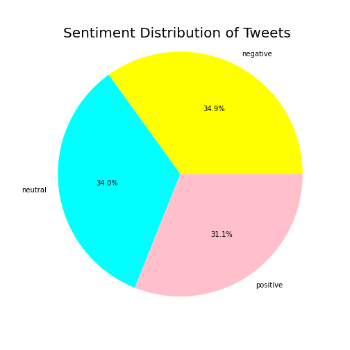
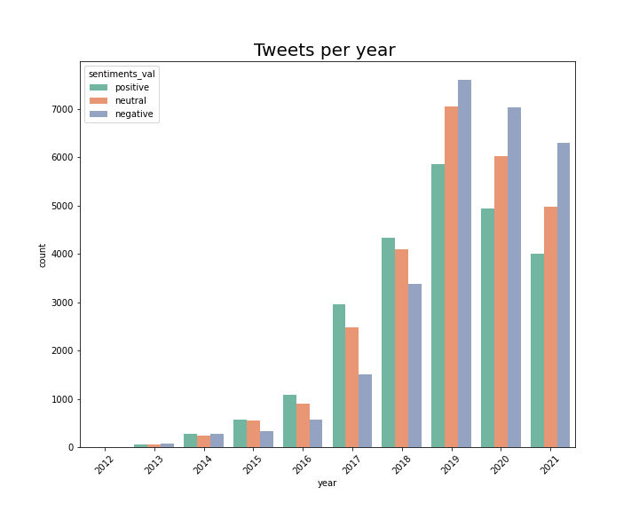

# Electric Vehicle Twitter Sentiment Analysis

## Overview
  * The goal of this project is to build a machine learning model that analyzes tweets and predicts their sentiments i.e. Positive, Negative and Neutral.
  * The project primarily focuses on general sentiments about Electric cars only.
  * The approach to implement this model is to:
       <ul>
           <li>Train a custom Word2vec model on the tweet dataset. It will assign embeddings to every word within the corpus.</li>
           <li>Train a KMeans clustering algorithm to group similar meaning words in the same clusters. This gives us intuition about positive, negative, and neutral words.</li>
           <li>Compute the sentiments of a whole tweet by averaging out the sentiments of individual words within the tweet. Thus we get our labels.</li>
           <li> Now we follow a supervised training approach, wherein we'll train our models based on the train and test labels.</li>
           <li>The best-performing model will be selected for further analysis</li>
     </ul>
   *  Analyze Tesla tweets about electric cars and check if there is any correlation with its stock market. 

### The Data
* Tweets were collected using **Twint** library with search word: "electric car“ and 10 minimum likes for each tweet. 
* Total tweets collected were 89837 with 36 different features.
* The Tesla stocks data were collected using **yahoo finance** library, it is consists of 2761 rows.
* Collected tweets and stocks are from January 1st, 2010 to June 17, 2021

## Business Problem

  * **Electric cars are the future**, is a statement that has been extensively marketed by experts in the last few years. Due to this, their popularity is booming and a lot of big players from the automobile industry have shown keen interest in them.
  * Are potential buyers enthusiastic about the emergence of EVs or is it just another marketing facade?
  * Will People prefer EVs over traditional cars due to their green technology or are they worried that excessive use and replacements of batteries is just going to burden the environment even further
  * Do people feel they'll save costs related to petrol/diesel or are they more worried about the high prices of EVs and their maintenance?
  * What proportion of the population is really positive/negative about the EV market or are they  just neutral?
* Do Markets reflect the extreme sentiments and human irrationality? Mass psychology's effects may not be the only factor driving the markets, but it’s unquestionably significant
 * With the real-time information available through platforms such as Twitter, we have all the data to correlate the real-time sentiments with respect to market volatility
 * The main objective is to check if the sentiments on Twitter actually correlate with the stock prices and if they do then by what margin?

## Sentiment Distribution

Out of 77467 tweets from the dataset:
   * 34.9.6% are Negative sentiments
   * 34.0% are Neutral sentiments
   * 31.1% are Positive sentiments
 
The data seems to be equally spread out between positive, negative, and neutral sentiments with negative sentiments leading marginally

#### Tweets Sentiment per year
 * There has been a steady rise in interest towards Electric cars since 2012.
 *  The number of tweets per year gradually increased from 2017. Hence, we can safely assume, that people are picking up interest in Electric Vehicles in the past 3-4 years.
 * Till 2018 The sentiment was more leaned towards a positive outlook.
 * Although the sentiment is still largely positive, but since 2019, the proportion of negative sentiments have been on a steady rise
* In 2019, there has been an inverse trend leaning more towards negative sentiments because of the concern that quiet EVs made the roads more unsafe for visually impaired walkers, older people, and children. 
* This also can be attributed to the fact that in 2019 had a Climate Action Summit due to which the of people thinking batteries would further Damage the environment might have increased.
 *  In 2020, we had a devastating pandemic which has increased more negative sentiments towards electric cars, as  they have a high-cost price due to the majority of the production facilities remain closed or are not able to attain full production capacity due to shortage of staff and raw materials.

#### Sentiments Stock Correlation:
* Both the stock prices and Sentiments curve have followed an exceptionally similar trend in 2021, and they had a strong correlation of 86%.
* The values for both the curves have been a little volatile this year.
* Since May, the sentiments for Tesla seemed to have improved, whereas the stock prices are still on a decline

## Conclusion
#### Tweets
* I tried to classify the tweet sentiments using pre-trained models such as Textblob, Bert, and glove. However, I got the best results from a word2vec model trained customly on the Electric cars tweet
* After exploring multiple classifying models through cross-validation technique and vectorizing with dif, and also neural network LSTM and bert model found out that Multinomial NB and Logistics Regression models performed the best on the given dataset
* After filtering out non-English Tweets and removing all tweets which do not have the word:"Car", visualized the dataset and observed that the data seems to be equally spread out between positive, negative, and neutral sentiments.
* All the models perform better with Lemmatization and Tfdif vectorizer. Tfdif gives us most frequently present n-grams(words) within our dataset that helps our model to understand the data more efficiently and map correlations.
* The best performing model of the whole lot was MultinomialNB. It gave us an accuracy of 77% 
* MultinomialNB describes the probability of observing counts among a number of categories which helps us distinguish between positive, neutral, and negative sentiments with a decent accuracy
#### Stocks
* The Sentiments curve and stock prices have shown a similar trend over the past few years. 
* They have followed very close to each other for major parts of the year 2017.2018,2019 and 2021.
* The Year 2020 was a complete anomaly wherein the stock prices boomed but the sentiments plummeted. However, this can be attributed to the devastating effects of the pandemic.
* The year 2021 brings some hope wherein both stock prices and sentiments have shows a good amount of appreciation in their values.

### Recommendation
#### Tweets
* Tweeples (people on Twitter) are enthusiastic about the emergence of EV's and mostly have positive sentiments attached to it
* A lot of them have reserved their thoughts on EVs. Hence, we have a good portion of people with neutral sentiments in the dataset as well
* A fair amount of them has genuine concerns about the impact of EVs on the environment. It will be helpful if experts or car manufacturers could explain the larger impact of EVs on the environment. 
* In early 2019, There is also concern that quiet EVs made the roads more unsafe for visually impaired walkers, older people, and children. However,  the law that required: "Electric cars must make noise after September 2019"  will definitely help build positive sentiments.
* Tweeples are also worried about the costs associated with EVs. However, large tax rebates and lower interest rates might convince them otherwise. in addition to that, Many automakers have plans to make affordable electric vehicles in all shapes and sizes in the coming years.
* Not enough reliable charging stations to accommodate a sudden increase in EV usage, but automakers and charging company EVGo announced plans to add about 700 fast-charging stations. 
#### Stocks
* Although the curves are able to map a trend with respect to each other. They fail to have a strong correlation.
* In the absence of a strong correlation, prediction becomes challenging. Hence, it is near impossible to have good stock prices predictions based only on the sentiments.
* Also, it can be seen that it's the sentiments' curve that follows the stock market curve and not the other way around. This makes sense, as people usually tend to react to the stock prices

### Final Thought:
* The above analysis proves that it is possible to capture a trend between stock prices and the sentiments of the people. However, I could not find any conclusive evidence to suggest that sentiments, as a standalone feature, are good enough to predict stock prices

### Future work
- Using time series analysis on Stocks and Twitter data for correlation analysis.
- Deploy the project using Streamlit.